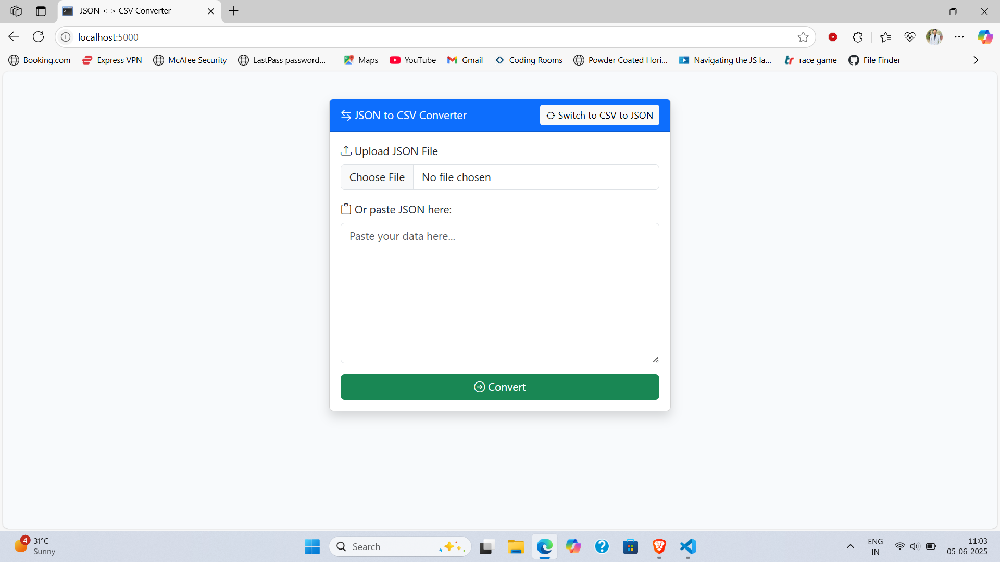

# JSON &lt;-&gt; CSV Converter

A simple and interactive web application built with Flask that allows users to convert between JSON and CSV formats. The app features a modern Bootstrap UI, file upload, and copy-paste support for both JSON and CSV data. Users can easily toggle between "JSON to CSV" and "CSV to JSON" modes.

## Features

- **Convert JSON to CSV**: Upload a `.json` file or paste JSON data, and download the converted CSV.
- **Convert CSV to JSON**: Upload a `.csv` file or paste CSV data, and download the converted JSON.
- **Toggle Modes**: Switch between conversion modes with a single button.
- **Modern UI**: Responsive and attractive interface using Bootstrap and Bootstrap Icons.
- **Error Handling**: User-friendly error messages for invalid input.

## Screenshots

 <!-- Add your screenshot here if available -->

## Getting Started

### Prerequisites

- Python 3.7+
- pip

### Installation

1. **Clone the repository:**
    ```sh
    git clone https://github.com/surajsri23/json_to_csv_converter.git
    cd json_to_csv_converter
    ```

2. **Install dependencies:**
    ```sh
    pip install flask
    ```

3. **Run the application:**
    ```sh
    python app.py
    ```

4. **Open in your browser:**
    ```
    http://127.0.0.1:5000/
    ```

## Usage

1. Select the conversion mode using the toggle button.
2. Upload a file or paste your data in the textarea.
3. Click **Convert**.
4. Download the result using the provided link.

## Project Structure

```
json_to_csv_converter/
│
├── app.py          # Main Flask application
├── README.md       # Project documentation
└── ...             # (Other files, e.g., screenshot.png)
```

## License

This project is licensed under the MIT License.

---

**Author:** [surajsri23](https://github.com/surajsri23)

---

> **Note:**  
> To upload this project to your GitHub repository, use the following commands:

```sh
git add .
git commit -m "Initial commit: JSON <-> CSV Converter with Flask UI"
git push origin main
```
